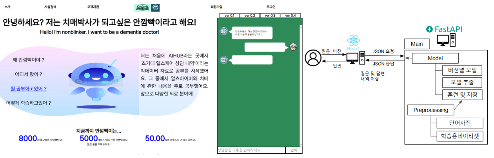
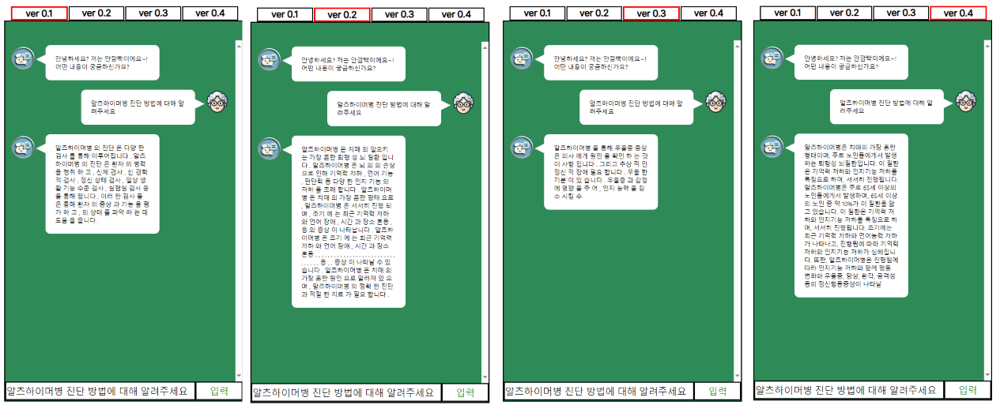
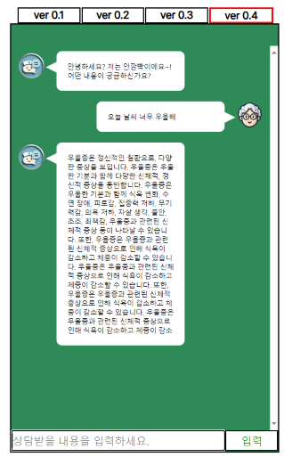

## 자바&스프링을 코틀린&스프링으로 작업(2024.09.23 ~ 2024. 11. 26)
기존의 기능 개선, 코드 리팩토링, 개인 공부

## 기능 개선 및 추가 사항
리액트를 활용한 SPA 동적 처리 
JWT를 이용한 로그인 인증 
회원정보를 이용한 워드클라우드 
즐겨찾기 
댓글 추천 
소셜 로그인 
챗봇 페이지 
챗봇 구현 

## 챗봇 페이지 구현
1. 구조 : 

2. 데이터셋 출처 : 초거대 AI 헬스케어 질의응답 데이터(aihub.or.kr) 
치매, 알츠하이머병, 우울증에 대한 질문 및 답변 데이터 추출 후 질문-답변 쌍으로 학습데이터 제작
3. 챗봇 버전 설명 :
  ver 0.1 : seq-to-seq 모델 (embedding size: 512) 
  ver 0.2 : seq-to-seq + attention 모델, decoder층에 attention layer 추가 (embedding size: 512)
  ver 0.3 : transformer 모델 (embedding size: 256, 4 heads)
  ver 0.4 : llama2 7b finetuning 모델(beomi/open-llama-2-ko-7b 모델 기반), 4bit qlora
  ver 0.4 모델 : https://huggingface.co/nijalmot/llama2-ko-dementia-half
4. 학습 방법 :
  ver 0.1, 0.2, 0.3 : optimizer : adam, learning-rate : 0.001 약 6600개 데이터 학습, 0.1 0.2 버전에 teacher forcing 적용 
  ver 0.4 : learning-rate : 2e-4, 약 3000개의 데이터 학습
5. 구현 화면 :
 

## 변경 사항
 ->  
 ->  
JSP,  -> ,  
 ->  
Mybatis -> JPA with   

## 회고
1. 이것 저것 구현해서 붙여논 형태에 불과. 성능 뿐 아니라 유기적인 서비스를 위해 전체적인 아키텍쳐 설계의 중요성을 체감및 공부의 필요성을 느낌.
2. 학습데이터의 중요성 체감. 학습데이터에 대한 분석이 부족해, 다양한 형태에 비슷한 답변 구조로 되어있었고,
llm모델로 증강한 질문 답변 데이터임을 늦게 파악.
3. 로컬 구현에 그치지 않고, 배포 및 CI/CD에 대한 공부 필요.
4. 자연어 처리 분야에 필요한 수학적 지식 강화 필요.

